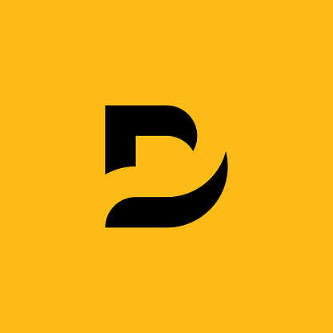

<div align="center">
  
  <h1>Dinath Sivaranjan — Personal Portfolio</h1>
  <p>
    <b>A modern, high-performance personal portfolio built with Next.js 15, React 18, and Tailwind CSS.</b>
  </p>
  
  <p>
    <a href="https://github.com/dinathsv">GitHub</a> • 
    <a href="https://www.linkedin.com/in/dinath-sivaranjan">LinkedIn</a> • 
    <a href="mailto:sdinath0528@gmail.com">Email</a>
  </p>

  <p>
    
    
    
    
  </p>
</div>

<br />

## 🌟 Overview

Welcome to the repository for my personal portfolio website! This project serves as a centralized hub showcasing my professional journey, skills as a **Full Stack Developer**, and the diverse range of projects I've built across web development and software engineering.

Designed with a sleek, polished dark mode aesthetic and thoughtful micro-animations, this website prioritizes **speed, clarity, and user experience**.

---

## ✨ Key Features

- **Modern Tech Stack**: Powered by `Next.js 15` (App Router) and `React 18`.
- **Beautiful UI/UX**: Custom styled with `Tailwind CSS`, featuring a cohesive dark mode and responsive design across all devices.
- **Smooth Animations**: Interactive and purposeful motion implemented using `Framer Motion`.
- **Dynamic Content**: Data-driven components managed cleanly through a centralized `config.js` for easy updates to projects, skills, and experience.
- **Integrated Contact Form**: Seamless user outreach leveraging `@emailjs/browser` with toast notifications via `Sonner`.
- **Live Spotify Integration**: Displays recent tracks using the Spotify API.

---

## 🛠️ Built With

### Frontend
- **Framework**: Next.js (App Router)
- **Library**: React.js
- **Styling**: Tailwind CSS
- **Animations**: Framer Motion
- **Icons**: React Icons, Lucide React, Radix UI

### Development & Tooling
- **Linting**: ESLint
- **Package Manager**: npm

---

## 🚀 Getting Started

To run this project locally, follow these steps:

### Prerequisites
Make sure you have [Node.js](https://nodejs.org/) installed on your machine.

### Installation

1. **Clone the repository:**
   ```bash
   git clone https://github.com/dinathsv/Dinath-portfolio-website.git
   cd Dinath-portfolio-website/Dinath-portfolio-website-main
   ```

2. **Install dependencies:**
   ```bash
   npm install
   ```

3. **Set up Environment Variables:**
   Create a `.env.local` file in the root directory and add any necessary keys (e.g., EmailJS keys, Spotify API credentials).

4. **Run the development server:**
   ```bash
   npm run dev
   ```

5. **Open the application:**
   Navigate to [http://localhost:3000](http://localhost:3000) in your browser.

---

## 📂 Project Structure

- `app/`: Next.js App Router pages and layouts.
- `components/`: Reusable UI components (Hero, ProjectCard, ContactForm, etc.).
- `lib/`: Utility functions and helpers.
- `public/`: Static assets such as images and icons.
- `config.js`: Centralized configuration containing data for skills, projects, and experiences.

---

## 💼 About Me

I am Dinath Sivaranjan, a passionate **Full Stack Developer** currently working at Inncome Developers. I specialize in building robust web applications and have hands-on experience with:
- **Frontend**: JavaScript, React, Tailwind CSS, HTML/CSS
- **Backend**: Laravel, Python (Django), Node.js, PHP
- **Databases**: MySQL, MariaDB, SQLite

---

## 📜 License

This project is open-source and available under the standard MIT License. Feel free to use it as inspiration!

<div align="center">
  <i>Designed and developed by Dinath Sivaranjan.</i>
</div>
